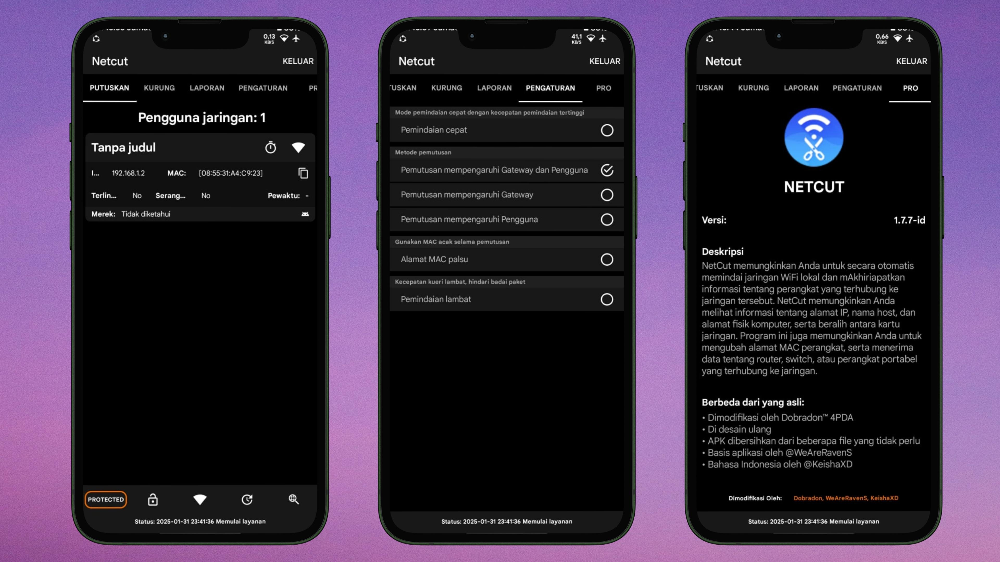

<h2>Netcut Mod Bahasa Indonesia</h2>
Netcut adalah aplikasi untuk mengelola dan memantau jaringan lokal, yang memungkinkan pengguna memutus koneksi perangkat lain, menampilkan informasi perangkat (IP dan MAC Address), serta mengontrol penggunaan bandwidth. Aplikasi ini juga meningkatkan keamanan jaringan dengan mengidentifikasi perangkat tidak dikenal. Cara kerjanya melibatkan pemalsuan alamat MAC untuk mengontrol koneksi di jaringan yang sama.

## Warning!!!
Aplikasi ini mungkin terdeteksi sebagai virus oleh Google Play, tetapi Anda dapat mengabaikannya karena saya tidak akan mencuri data Anda.

## Apa Yang Di Modifikasi ?
- [x] Akses Pro 
- [x] Di design ulang 
- [x] Dibersihkan dari file yang tidak perlu
- [x] Mengubah bahasa default dari bahasa inggris ke bahasa Indonesia 
- [x] Mengubah logo Netcut
- [x] Menambah [-id] pada versi Netcut

## Downloads
Untuk mengunduh aplikasi ini, silakan masuk ke halaman [Release](https://github.com/KeishaXD/Netcut-Bahasa-Indonesia/releases)

## Mengalami Masalah ?
- Q : Kok gabisa dipake ?
- A : Restart HP dulu

- Q : Kok tulisannya "Device belum di root" ?
- A : Matiin magisk hide / tambah ke "Su List"

## Thanks To:
- [@Dobradon™4PDA](https://4pda.to/forum/index.php?showtopic=762089&st=640#entry106934857) Untuk akses pro
- [@WeAreRavenS](https://t.me/WeAreRavenS) Untuk design ulang
